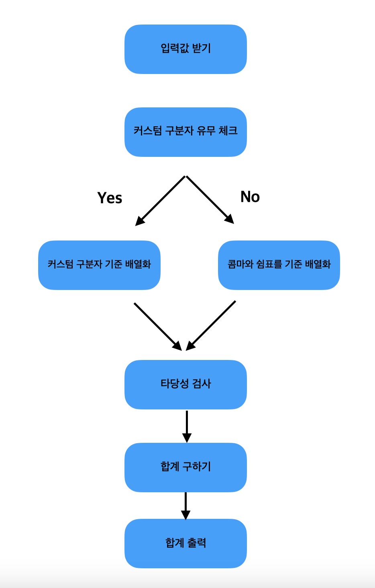

# 프리코스 1주차 미션 [문자열 덧셈 계산기] ☝️

## 기능 로직

## 구현할 기능 목록 🚩

- 입력, 출력 기능 (모듈화) ✅
- 커스텀 구분자의 존재 여부를 판단하는 기능 ✅
- 커스텀 구분자를 기준으로 구분(배열화) 하는 기능
- 쉼표(,)와 콜론(:)을 기준으로 구분(배열화) 하는 기능
- 분리된 숫자로부터 덧셈 기능
- 사용자의 입력 타당성 검사 ("[ERROR]로 시작")

### 한 단계 더 🔥

- 가독성과 성능을 위해 정규식 쓰지 않고 구현하기
  (좋을 때도 있지만.. 정규식은 가독성이 떨어지는 모습 🐸🐸)
- 기능별 코드 길이 10줄 이하

#### 주어진 요구사항 🎯

##### 과제 진행 요구 사항 1️⃣

- 기능 구현 전 기능 목록을 정리해 추가한다.
- Commit 단위는 기능 목록 단위로 추가한다.
- Angular JS Git Commit Message Conventions 참고하여 Commit Message를 작성한다.

##### 기능 요구 사항 2️⃣

- 쉼표(,) 또는 콜론(:) 구분자로 가지는 문자열을 전달하는 경우 구분자를 기분으로 분리한 숫자의 합을 반환한다.
- 앞의 기본 구분자(쉼표, 콜론) 외에 커스텀 구분자를 지정할 수 있다. 커스텀 구분자는 문자열 앞부분의 "//"와 "\n" 사이에 위치하는 문자를 커스텀 구분자로 사용한다. (예를 들어 "//;\n1;2;3"과 같이 값을 입력할 경우 커스텀 구분자는 세미콜론(;)이며, 결과 값은 6이 반환되어야 한다.)
- 사용자가 잘못된 값을 입력할 경우 "[ERROR]"로 시작하는 메시지와 함께 Error를 발생시킨 후 애플리케이션은 종료되어야 한다.

##### 프로그래밍 요구 사항 3️⃣

- Node.js 20.17.0 버전에서 실행 가능해야 한다.
- 프로그램 실행의 시작점은 App.js의 run()이다.
- package.json 파일은 변경할 수 없으며, 제공된 라이브러리와 스타일 라이브러리 이외의 외부 라이브러리는 사용하지 않는다.
- 프로그램 종료 시 process.exit()를 호출하지 않는다.
- 프로그래밍 요구 사항에서 달리 명시하지 않는 한 파일, 패키지 등의 이름을 바꾸거나 이동하지 않는다.
- 자바스크립트 코드 컨벤션을 지키면서 프로그래밍한다. (기본적으로 JavaScript Style Guide를 원칙으로 한다.)
