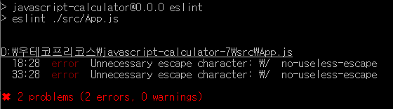

# javascript-calculator-precourse

## Analyze the problem

1. 입력 파서

- 연산식은 쉼표와 콜론 중 하나 이상 사용하여 구분하므로, 정규 표현식(Regular Expression)으로 구분하는 것이 좋다.
  - 포맷에 맞지 않으면 예외 처리한다.
- 커스텀 구분자 지정 기능
  - 커스텀 구분자의 종결 문자가 `\\n`인 경우를 분리한다.
  - 분리 이후 커스텀 구분자 선언에 맞는지 정규표현식으로 검사한 후 틀리면 예외 처리, 맞을 경우에는 커스텀 구분자를 뽑아 연산식에 적용한다.
- 양수만 숫자 입력으로 받는다는 사실에 유의한다.

2. 코딩 스타일과 아키텍처

- 코딩 스타일
  - 반드시 [제시된 스타일 가이드](https://github.com/woowacourse/woowacourse-docs/tree/main/styleguide/javascript)를 따른다.
    - 상수는 대문자 및 언더바(\_) 사용
    - 클래스 및 메서드 등에 특수문자 사용 금지($, \_ 등)
  - 반드시 우테코 전용 API를 사용한다(Console.readLineAsync, Console.print)
- 아키텍처
  - 사용자 입력 -> 입력 파서 -> 처리 -> 출력 포맷 결정 -> 출력 순으로 분리한다.
  - 가능하면 함수형 프로그래밍 스타일을 사용하며, 한 메서드 내에 10줄 정도의 코드를 유지하도록 함수 분리를 시행한다.
  - 처리 루틴이 길 경우 별도의 파일로 분리한다.

## References

- [Node.js 기본 Documentation](https://nodejs.org/docs/latest/api/)
- [미션용 라이브러리 GitHub Repo](https://github.com/woowacourse-projects/javascript-mission-utils)

## Target features

- 1단계: 기능 구현

* [x] 사용자 입력을 받고 그대로 출력하기
* [x] 사용자 입력에 대한 파서를 제작하고 파싱 결과를 출력하기
* [x] 처리 루틴 제작
* [x] 출력 포맷 구현

- 2단계: 1차 리팩토링

* [x] 스타일링 가이드와 비교하기
* [x] 아키텍처 계획에 맞게 리팩토링되었는지 확인

- 3단계: PR 후 2차 수정

* [ ] PR 피드백이 있으면 결과에 따라 코드 수정

## 추가 과정
코드 작성 및 테스트 후 ESLint로 스타일 검증하는 연습을 수행하였다.

ESLint + Prettier를 VS Code와 연계하여 사용하며, [airbnb에서 제공한 린트 세팅](https://www.npmjs.com/package/eslint-config-airbnb)에 따라 다음과 같이 패키지를 설치하였다. Airbnb의 자바스크립트 린팅 설정은 아직 ESLint v9을 지원하지 않아, v8로 설치해야 한다[(링크)](https://github.com/airbnb/javascript/issues/2961)

```Shell
  npm install --save-dev eslint@8.x.x prettier eslint-config-prettier eslint-plugin-prettier eslint-config-airbnb eslint-plugin-airbnb
  npm init @eslint/config # 이것으로 ESLint 설정 파일을 생성한 후 적절하게 수정한다.
```

설정 파일(.eslintrc 및 eslint.config.js)로 Linting한 결과는 다음과 같다.



* 정규표현식에서 let으로 인스턴스를 선언하도록 바꾸었을 때 / 문자에 불필요한 역슬래시(\)가 붙었다고 되어 있다. 그러나 실제로 돌려보면 해당 역슬래시가 없으면 정규표현식 구문 내 조건이 중간에 끊긴 것으로 판단하기 때문에 반드시 넣어야 한다.

package.json의 dev dependencies로 추가 패키지가 반드시 들어가야 수행이 가능하기 때문에 테스트 후 원래의 package.json롤백하였으며 변경된 package.json은 linttest 확장자를 추가하여 구분하도록 백업하였다.