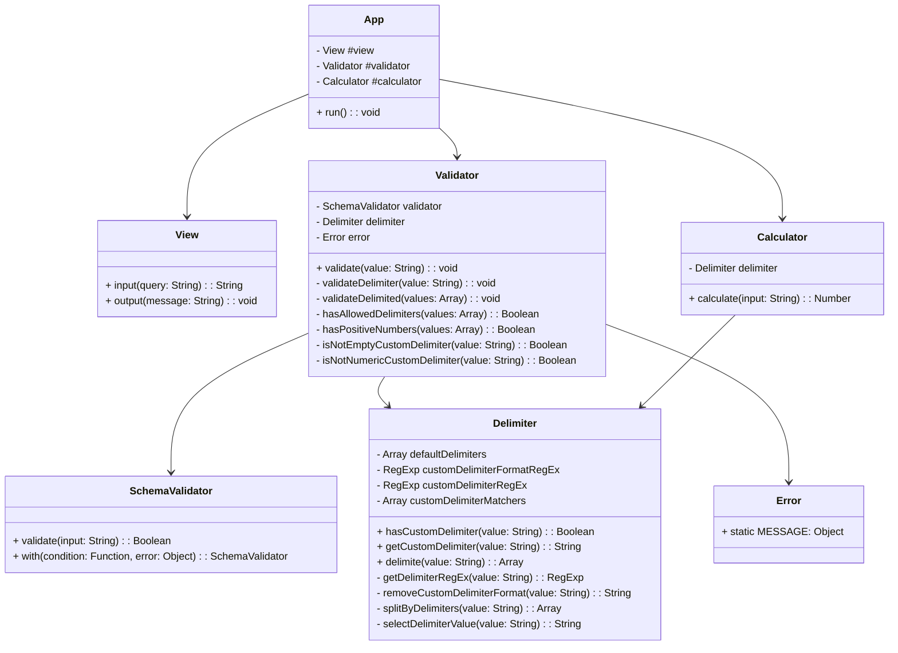

# javascript-calculator-precourse

## 구현 기능 목록

### Order

동작 순서로 정리한 목록입니다.

- [x] 덧셈할 문자열을 입력 받는다.
- [x] 문자열 앞부분의 커스텀 구분자 여부를 확인한다.
- [x] 커스텀 구분자가 존재하는 경우 커스텀 구분자를 함께 구분자로 사용하고 아닌 경우 기본 구분자만을 사용하여 분리된 문자열을 반환한다.
- [x] 구분자를 기준으로 분리된 문자가 숫자가 아닌 경우 에러 메시지와 함께 에러를 발생시킨다.
- [x] 구분자를 기준으로 분리된 문자가 양수가 아닌 경우 에러 메시지와 함께 에러를 발생시킨다.
- [x] 분리된 문자열이 유효한 경우 각 숫자의 합을 반환한다.
- [x] 문자열 덧셈 계산기를 실행시킨다.
- [x] 에러가 발생한 경우 애플리케이션을 종료시킨다.

### Object

객체 위주로 정리한 목록입니다.

- View: input, output과 관련된 UI를 담당합니다.
- Calculator: 문자열 덧셈 계산과 관련된 기능을 담당합니다.
- Validator: 유효성을 검증하고 에러를 반환하는 기능을 담당합니다.
- App: 어플리케이션의 실행과 종료를 담당합니다.

#### View

- [x] 덧셈할 문자열을 입력 받는다.

#### Calculator

- [x] 문자열 앞부분의 커스텀 구분자 여부를 확인한다.
- [x] 커스텀 구분자가 존재하는 경우 커스텀 구분자를 함께 구분자로 사용하고 아닌 경우 기본 구분자만을 사용하여 분리된 문자열을 반환한다.
- [x] 분리된 문자열의 유효성을 확인하고 유효한 경우 각 숫자의 합을 반환한다.

#### Validator

- [x] 구분자를 기준으로 분리된 문자가 숫자가 아닌 경우 에러 메시지와 함께 에러를 발생시킨다.
- [x] 구분자를 기준으로 분리된 문자가 양수가 아닌 경우 에러 메시지와 함께 에러를 발생시킨다.

#### App

- [x] 문자열 덧셈 계산기를 실행시킨다.
- [x] 에러가 발생한 경우 애플리케이션을 종료시킨다.

## 구현후 기능 목록

### 📁 Structure

#### src

```md
src/
├── App.js
├── index.js
├── app/
│ ├── App.js
│ ├── Calculator.js
│ ├── Delimiter.js
│ ├── Error.js
│ ├── Validator.js
│ └── View.js
└── lib/
├── SchemaValidator.js
└── utils.js
```

#### test

```md
test/
├── Calculator.test.js
├── Delimiter.test.js
├── Validator.test.js
└── View.test.js
```

### 📝 Description

- `OOP(Object-Oriented Programming)` 관점에서 문제를 해결하기 위해 노력했습니다.
- 가능한 모든 함수에 테스트를 작성하기 위해 노력했습니다.
- `type-safe`한 코드를 작성하기 위해 노력했습니다.
- `선언적인(Declarative)` 코드를 작성하기 위해 노력했습니다.
- 가능한 작은 함수를 만들기 위해 노력했습니다.

### ♻️ Object



**App**

- App: 문자열 덧셈 계산기를 동작시키는 역할을 담당한다.

- Calculator: 문자열 덧셈 계산기에 필요한 연산을 담당한다.
- Delimiter: 문자열 덧셈 계산기에 사용되는 구분자와 관련된 기능을 담당한다.
- Error: 문자열 덧셈 계산기에서 사용되는 에러를 담당한다.
- Validator: 문자열 덧셈 계산기에 입력된 값에 대한 유효성 체크를 담당한다.
- View: 문자열 덧셈 계산기에서 사용자에게 보여지는 부분을 담당한다.

**Lib**

- SchemaValidator: 유효성 검증을 선언적으로 사용하기 위한 유틸 클래스입니다.
- utils: 재사용될 수 있는 작은 단위의 유틸 함수 모음입니다.
