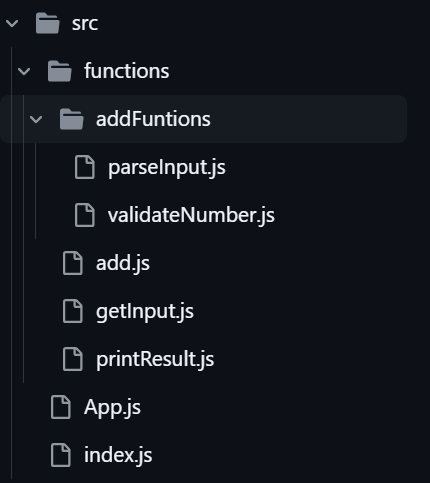

# javascript-calculator-precourse
## ✅ 구현 기능 목록
- [x] 문자열 입력 받기
- [x] 커스텀 구분자 처리
- [x] 문자열 구분자로 구분
- [x] 추출한 숫자 더하기
- [x] 입력값 잘못된 경우 에러 처리 & 종료

## 📚 공부
- [x] git 커밋 메시지 공부
- [x] Console API 공부
    - [ ] 입력받을 때 Async 왜 사용하는지?
- [ ] 정규표현식 정리

## 💻 구현 내용
### 문자열 입력 받기
```
  async getString(){
    try{
      const inputStr = await Console.readLineAsync('덧셈할 문자열을 입력해 주세요\n');
      return inputStr;
    } catch(error){
      Console.print('Error: ' + error.message);
      return null;
    }
  }
```
- @woowacourse/mission-utils에서 제공하는 Console API를 사용헤 덧셈할 문자열을 입력받아 리턴하는 메서드를 만들었다.
- 오류가 발생하면 오류 메시지를 출력하고 null을 리턴하였다.

### 커스텀 구분자 처리
```
  getCustom(str){
    const regex = /\/\/(.*?)\\n/;
    const customSeperator = str.match(regex);

    return customSeperator ? customSeperator[1] : null;
  }
```
- 정규표현식을 사용해 `//`와 `\n`사이에 있는 문자를 추출하였다.
- match 메서드로 추출한 값이 배열이고, 첫 번째 요소는 전체 매칭된 부분, 두 번째 요소는 내가 찾았던 부분이므로 index 1번 값을 리턴하게 하였다.
- `\n`이 줄바꿈을 의미하는 이스케이프 문자로 인식되어서 제대로 인식되지 않는 문제가 있었는데 \n앞에 \을 붙여 \\n으로 사용하니 \n을 그냥 문자로 사용할 수 있었다.

### 문자열 구분자로 구분
```
  separateStr(str, customSeperator = null){
    const delimiters = new RegExp(`[,:${customSeperator}]`)

    const strArr = str.split(delimiters);

    return strArr;
  }
```
- `,`, `;`, `커스텀 구분자`를 사용해서 문자열을 분리했다.
- 분리한 문자열은 배열로 저장되고 이 배열을 리턴하였다.

### 추출한 숫자 더하기
```
  getSum(strArr){
    const sum = strArr.reduce((accumulator, currentValue) => accumulator + Number(currentValue), 0);

    return sum;
  }
```
- reduce() 메서드를 사용해 배열을 돌면서 배열에 있는 값들을 모두 더해 sum에 저장해 반환하였다.
- 배열에 있는 값들이 모두 문자열이기 때문에 Number()를 사용해 숫자로 변환했다.

### 입력값 잘못된 경우 에러 처리 & 종료
```
  checkInput(strArr){
    for(let i = 0; i < strArr.length; i++){
      const num = Number(strArr[i]);
      Console.print(num + " ");
      if(isNaN(num) || num < 0)
        throw new Error("[ERROR]");
    }
  }
```
- 입력값이 구분자와 양수 외에 다른 문자로 이루어져 있는지 확인하는 메서드이다.
- strArr 배열의 값들을 Number() 메서드를 사용해 숫자로 변경했다.
- Number() 메서드를 사용했을 때 숫자로 바뀌지 않는 문자면 NaN이 저장되므로 isNaN() 메서드를 사용해서 숫자인지 아닌지 확인했다.
- 제대로 변경된 숫자는 음수인지 아닌지 확인했다.
- 두 조건 중 하나라도 만족하지 않으면 `throw new Error()`를 사용해 메시지와 함께 `Error`를 발생시킨후 애플리케이션을 종료했다.

## ⭐️ 결과 ⭐️ 
### test 결과


### 옳은 입력


### 잘못된 입력 시

