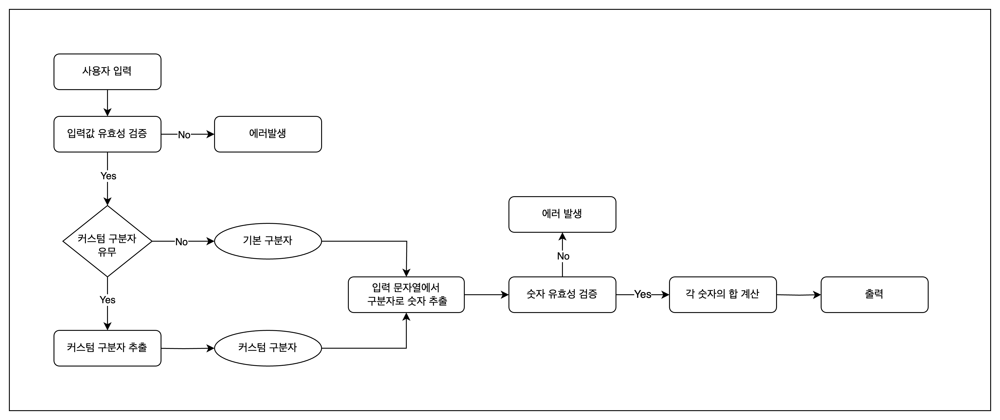

# javascript-calculator-precourse

## 📍 요구사항

입력한 문자열에서 숫자를 추출하여 더하는 계산기 구현

- 쉼표(,) 또는 콜론(:)을 구분자로 가지는 문자열에서 구분자를 기준으로 분리한 각 숫자의 합 반환
- 커스텀 구분자 지정 가능하며 문자열 앞부분의 "//"와 "\n" 사이에 위치하는 문자를 커스텀 구분자로 사용
- 잘못된 값 입력 시, 에러 발생 후 종료

## ✅ 구현해야 할 기능

- [x] 사용자 입력 받기
- [x] 입력값 유효성 검증
  - [x] 입력값이 없는 경우
  - [x] 입력값에 음수가 있는 경우
  - [x] `//`와 `\n` 사이에 문자가 앖는 경우
- [x] 커스텀 구분자 추출
- [x] 구분자를 기준으로 숫자 추출
- [x] 숫자 유효성 검증
- [x] 분리한 숫자들의 합 반환
- [x] 에러 처리

## 흐름도 설계



## 👩🏻‍💻 구현 내용 정리

### 1. 사용자 입력 받기

`@woowacourse/mission-utils`에서 제공하는 `Console` API를 사용하여 입력 구현

```js
export async function inputUserString() {
  const userInput = await MissionUtils.Console.readLineAsync(
    "덧셈할 문자열을 입력해 주세요.\n"
  );
  return userInput;
}
```

### 2. 입력값 유효성 검증

3가지 경우로 나눠서 구현

- 입력값이 없는 경우

```js
const emptyInput = (input) => {
  if (!input) throwError(ERROR_MESSAGES.INPUT_NOT_FOUND);
  return input;
};
```

- 입력값에 음수가 있는 경우

```js
const negativeInput = (input) => {
  if (/-\d/.test(input)) throwError(ERROR_MESSAGES.NEGATIVE_NUMBER);
  return input;
};
```

- //와 \n 사이에 커스텀 문자가 없는 경우로

```js
const nullCustomDelimiter = (input) => {
  if (/^\/\/\\n/.test(input)) throwError(ERROR_MESSAGES.CUSTOM_DELIMITER_NULL);
  return input;
};
```

### 3. 커스텀 구분자 추출

입력 받은 문자열과 정규 표현식을 사용하여 `match` 함수로 커스텀 구분자 추출

```js
export function getCustomDelimiter(string, regex) {
  const match = string.match(regex);

  if (match) return match[1];
  return null;
}
```

### 4. 구분자를 기준으로 숫자 추출

`split`, `map`, `filter` 함수를 활용하여 숫자 추출

```js
export function getNumber(string, delimiter) {
  return string
    .split(delimiter)
    .map((s) => s.trim()) // 각 요소에 대해 공백 제거
    .filter((s) => s !== ""); // 빈 문자열 요소 제거
}
```

### 5. 숫자 유효성 검증

구분자를 기준으로 분리한 숫자들이 숫자 타입인지 검증하기 위해 `isNaN` 활용

```js
export const isNumber = (value) => {
  if (isNaN(value)) return false;
  return true;
};
```

### 6. 분리한 숫자들의 합 반환

`reduce` 함수를 사용해 숫자들의 합 계산

```js
export const calculateSum = (nums) => {
  return nums.reduce((acc, val) => acc + parseInt(val), 0);
};
```

## 💥 트러블 슈팅

## 📖 참고 사항
