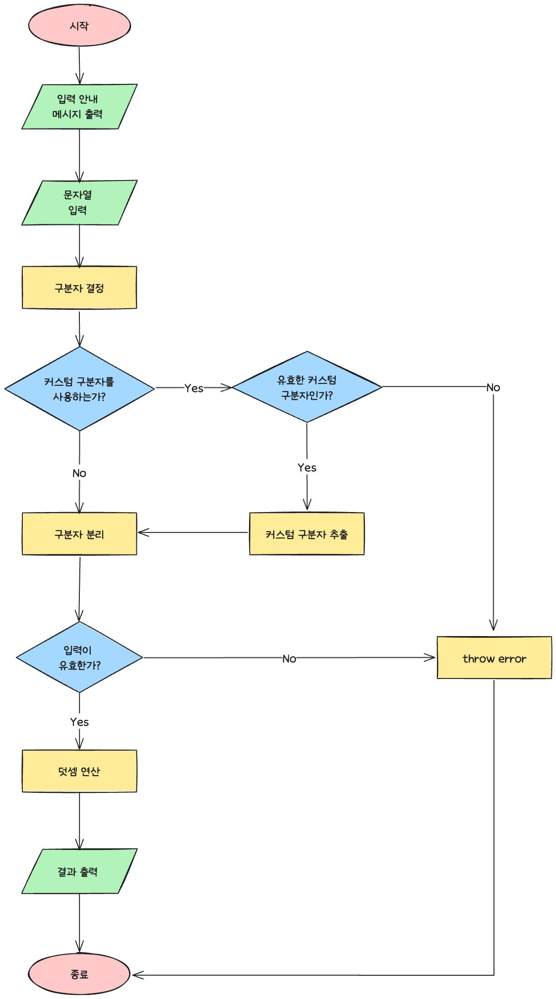
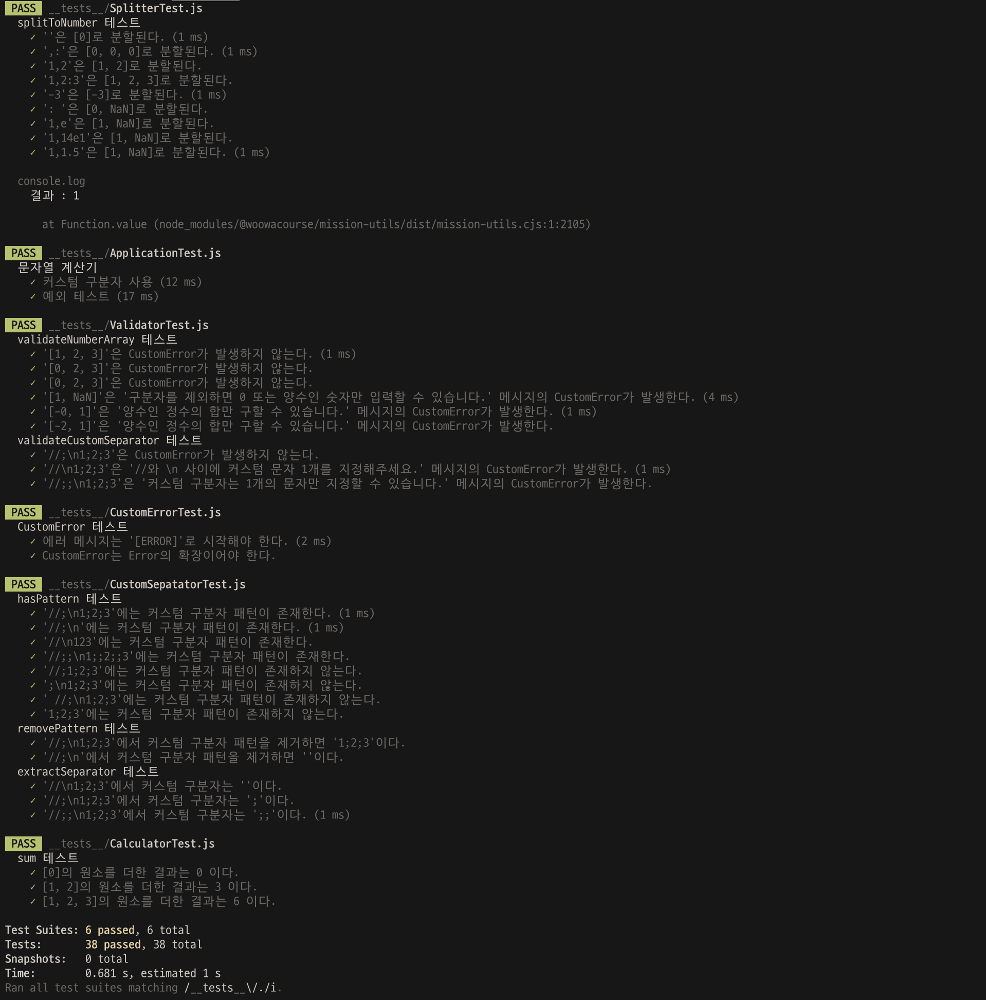

# javascript-calculator-precourse

## ✨ 기능 목록

- 문자열 입력 기능 (`view`)
  - 프로그램이 시작되면 `덧셈할 문자열을 입력해 주세요.` 라는 메시지를 출력한다.
  - 유저는 문자열을 입력한다.
- 구분자 분리 기능 (`split`)
  - 기본 구분자 2개(쉼표(`,`) 또는 콜론(`:`))를 이용해 숫자를 분리할 수 있다.
  - 커스텀 구분자 하나(`//`와 `\n` 사이에 위치하는 문자)를 이용해 숫자를 분리할 수 있다.
- 유효성 확인 기능 (`validate`)
  - 일반
    - 구분자로 구분된 문자가 숫자가 아닌 경우 에러 메시지와 함께 종료되어야 한다.
    - 구분자로 구분된 문자가 양수가 아닌 경우 에러 메시지와 함께 종료되어야 한다.
  - 커스텀 구분자를 사용하는 경우
    - 커스텀 구분자가 없는 경우 에러 메시지와 함께 종료되어야 한다.
    - 커스텀 구분자가 2개 이상인 경우 에러 메시지와 함께 종료되어야 한다.
- 덧셈 기능 (`add`)
  - 구분된 숫자들을 더한 결과를 반환해야 한다.
    - 숫자가 없는 경우 결과는 0이다.
- 결과 출력 기능과 종료 (`view`)
  - 덧셈 결과를 출력한다.
  - 프로그램을 종료한다.
- 에러 처리 (`error`)
  - 잘못된 값을 입력하는 경우 “[ERROR]”로 시작하는 메시지와 함께 `Error`를 발생시켜야 한다.

## 📝 요구 사항에 명시되지 않아 스스로 정한 규칙

- 커스텀 구분자를 사용하는 경우 기본 구분자는 사용되지 않는다.

  기능 요구사항에 커스텀 구분자를 사용하는 예시는 `"//;\n1;2;3"`으로 커스텀 구분자만 사용되어 이렇게 정했습니다.

- 커스텀 구분자는 1개만 사용할 수 있다.

  기능 요구사항의 커스텀 구분자 사용 예시 `"//;\n1;2;3"`에서 커스텀 구분자가 1개만 사용되어 이렇게 정했습니다.

- 양수인 0에서 9사이의 숫자만 유효한 입력으로 인정한다.

  소수(예: 1.5)나 지수표기법(예: 1e3)은 커스텀 구분자를 적용했을 때 정상 결과를 결정하기에 모호함이 있어 유효한 입력으로 인정하지 않았습니다.

## 🌠 Flow Chart

## ✅ 테스트 결과

